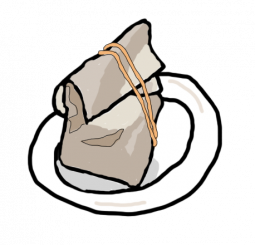

# Hi 👋, I'm DHIMAS LN

  

<h3 align="center">Cybersecurity Enthusiast from Indonesia</h3>

  
  &nbsp;&nbsp;
  
  &nbsp;&nbsp;
  
  &nbsp;&nbsp;
  

## 🎯 About Me
- 🌱 I’m currently diving deep into **Cybersecurity**
- 💬 Ask me about **Tech, Frontend, Security, and more**
- 📫 Reach me at **Linkedin**
- ⚡ Fun fact: **Some bugs are just misunderstood features!**

## 🌟 GitHub Stats

  <!-- GitHub Stats -->
  

  <!-- Streak Stats -->
  

  <!-- Top Languages -->
  

## 🧰 Cybersecurity Tech Stack

### 💬 Programming & Scripting

Currently exploring and improving my skills in these languages and scripting:

<table>
  <tr>
    <td align="center">
       Python
    </td>
    <td align="center">
       Bash
    </td>
    <td align="center">
       C
    </td>
    <td align="center">
       JavaScript
    </td>
  </tr>
</table>

### 🐧 Operating Systems & Environments
<table>
  <tr>
    <td align="center">
       Ubuntu Server
    </td>
    <td align="center">
       Arch Linux
    </td>
    <td align="center">
       OpenBSD
    </td>
    <td align="center">
       Windows Server22
    </td>
  </tr>
</table>

<table>
  <tr>
    <td align="center">
       Docker
    </td>
    <td align="center">
       Nginx
    </td>
    <td align="center">
       Git
    </td>
    <td align="center">
       VSCode
    </td>
  </tr>
</table>

### 🧩 Security, Monitoring & Analysis

  &nbsp;
  &nbsp;
  &nbsp;
  &nbsp;
  

### 👥 Community
<table>
  <tr>
    <td align="center">
       IRCNow
    </td>
    <td align="center">
       Imphnen
    </td>
    <td align="center">
       Noctra Lupra
    </td>
  </tr>
</table>

  

## 👨🏻‍💻 My Activity

## ☕ Support My Work

  
  

